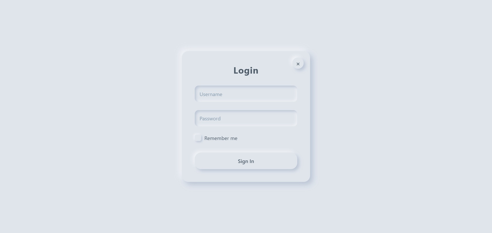

# Neumorphism Login Form

**Live Demo:** [https://kushalkumar-shaw.github.io/Neumorphism-Login-Form/](https://kushalkumar-shaw.github.io/Neumorphism-Login-Form/)



This project demonstrates a fully functional, responsive, and accessible login form designed using the Neumorphism (Soft UI) aesthetic. It features an interactive modal built with HTML, CSS, and Vanilla JavaScript.

## Features

- **Neumorphic Design**: Soft UI elements using CSS box-shadows (inset and outset) to create extruded and pressed states.
- **Interactive Modal**: The form opens inside a centered modal overlay that can be closed via a button, clicking outside, or pressing the Escape key.
- **Accessible**: Includes `aria` labels, visually hidden labels (`sr-only`) for screen readers, and proper keyboard navigation focusing.
- **Responsive**: Adapts to different screen sizes using percentage-based widths and media queries.
- **Clean Structure**: Separated into HTML, CSS, and JavaScript files for maintainability.

## Folder Structure

```
Neumorphism Login Form/
│
├── index.html       # Main HTML structure and modal
├── css/
│   └── style.css    # CSS styling, variables, and Neumorphism utilities
├── js/
│   └── script.js    # Modal interaction and accessibility logic
└── README.md        # Project documentation
```

## How to Run

1. Clone or download this repository.
2. Open the folder in your file explorer.
3. Double-click the `index.html` file to open it in your default web browser.
4. Click the "Open Login" button to interact with the Neumorphism form modal.
